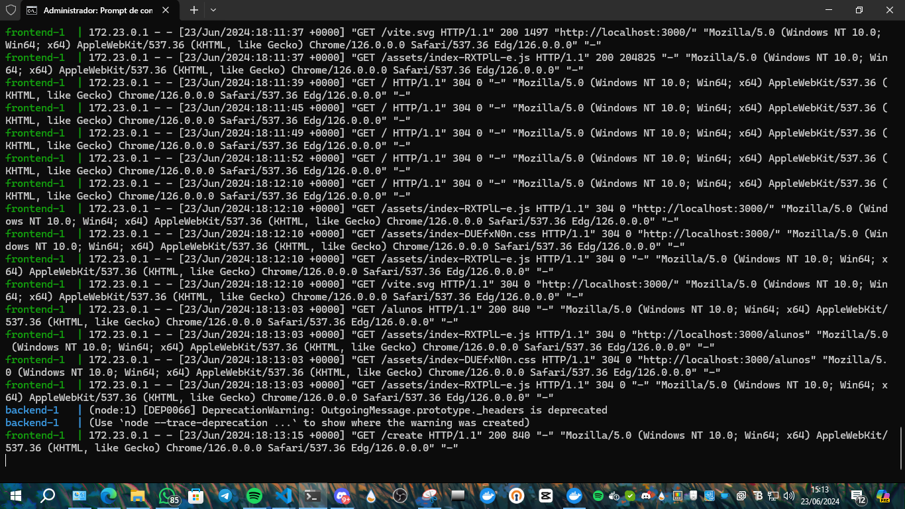
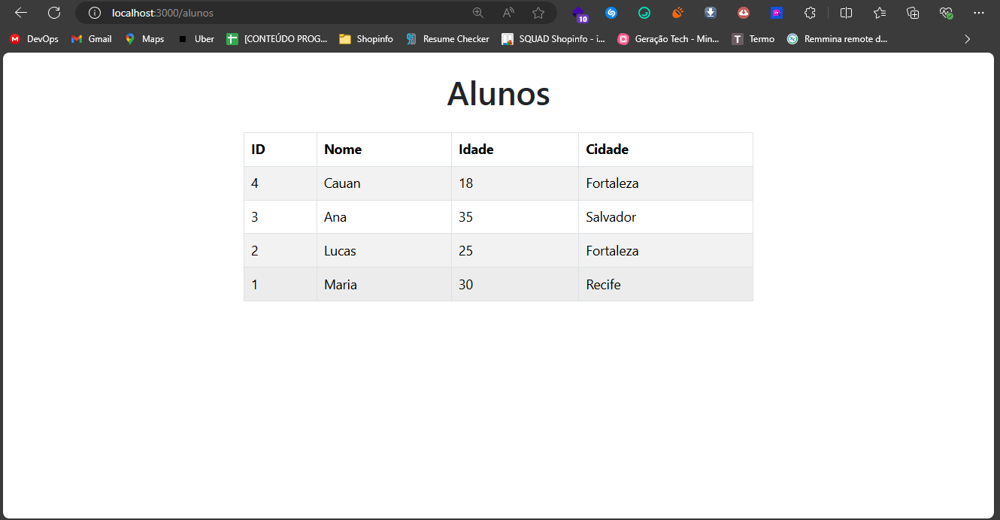

Para criar um README que explique o repositório contendo as pastas `frontend`, `backend` e `database`, além de descrever os serviços Docker Compose configurados, você pode seguir o exemplo abaixo:

---

# Repositório do Projeto IT Talent

Este repositório contém a aplicação IT Talent, que é dividida em três serviços principais: `frontend`, `backend` e `database`. Cada serviço está configurado em sua respectiva pasta no projeto.

## Estrutura do Projeto

```
/
├── backend/       # Código fonte do backend da aplicação
├── frontend/      # Código fonte do frontend da aplicação
└── database/      # Configurações do banco de dados MySQL
```

- **`backend/`**: Contém a lógica e os arquivos relacionados ao servidor backend da aplicação.

- **`frontend/`**: Contém a interface do usuário (UI) da aplicação desenvolvida em React.

- **`database/`**: Contém arquivos necessários para construir e configurar o banco de dados MySQL usado pela aplicação.

## Configuração do Docker Compose

O Docker Compose é utilizado para facilitar a execução dos serviços da aplicação em ambiente de desenvolvimento. Os serviços são configurados da seguinte forma:

### Serviços

- **`frontend`**:
  - **Porta**: 3000 (exposta localmente como 3000)
  - **Descrição**: Serviço responsável por servir o frontend da aplicação React.

- **`backend`**:
  - **Porta**: 5000 (exposta localmente como 5000)
  - **Variáveis de Ambiente**:
    - `APP_PORT`: Porta onde o servidor backend está rodando (5000)
    - `MYSQL_IP`: Endereço IP do serviço de banco de dados (`db`)
    - `MYSQL_PORT`: Porta do MySQL (3306)
    - `MYSQL_USER`: Usuário do MySQL (`root`)
    - `MYSQL_ROOT_PASSWORD`: Senha do usuário root do MySQL
    - `MYSQL_DATABASE`: Nome do banco de dados utilizado pela aplicação (`BANCO_DADOS_IT_TALENT`)
  - **Dependências**: Dependente do serviço `db` para funcionar corretamente.

- **`db`**:
  - **Porta**: 3306 (exposta localmente como 3306)
  - **Variáveis de Ambiente**:
    - `MYSQL_ROOT_PASSWORD`: Senha do usuário root do MySQL
    - `MYSQL_DATABASE`: Nome do banco de dados utilizado pela aplicação (`BANCO_DADOS_IT_TALENT`)
  - **Volumes**: Volume Docker para persistência dos dados do MySQL.

### Como Usar

1. **Pré-requisitos**:
   - Docker instalado no ambiente local.

2. **Instruções**:
   - Clone este repositório: `git clone https://github.com/seu-usuario/it-talent`
   - Navegue até o diretório do projeto: `cd it-talent`
   - Execute os serviços utilizando Docker Compose:
     ```
     docker-compose up -d --build
     ```
   - Acesse a aplicação frontend em `http://localhost:3000`.

## Imagens



