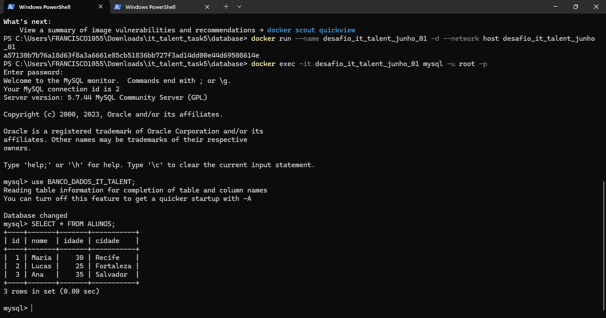
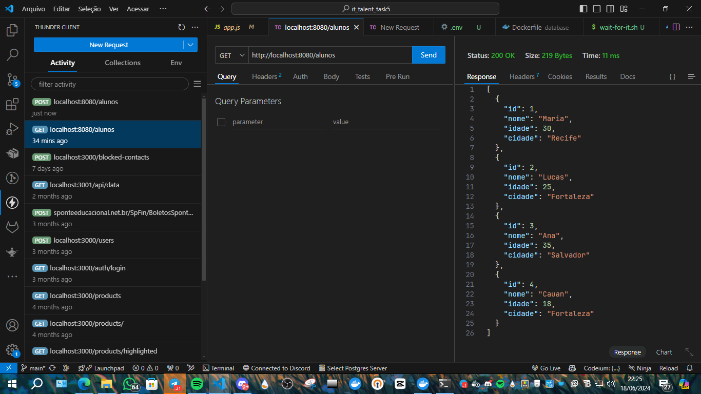

# Projeto de Conteinerização

## Visão Geral

Bem-vindo ao projeto de conteinerização da CloudOps Solutions. Neste projeto, vamos dockerizar duas aplicações: um banco de dados MySQL e um backend em Node.js. Esse guia irá ajudá-lo a configurar, construir e executar as aplicações em contêineres Docker, além de verificar a integração entre elas.

## Estrutura do Projeto

O projeto é composto por dois repositórios:

1. **Banco de Dados**: Repositório do Banco de Dados
2. **Backend**: Repositório do Backend

Cada repositório contém o código e os arquivos necessários para configurar e executar cada aplicação em um contêiner Docker.

## Pré-requisitos

- Docker instalado em sua máquina
- Docker Compose instalado (opcional, mas recomendado)
- Acesso aos repositórios do Banco de Dados e Backend

## Passos de Configuração

### 1. Configuração do Banco de Dados

#### Clone o Repositório do Banco de Dados

```bash
git clone <URL_DO_REPOSITORIO_DO_BANCO_DE_DADOS>
cd <nome_do_diretorio_clonado>
```

#### Criação do Dockerfile

Crie um arquivo `Dockerfile` com o seguinte conteúdo:

```dockerfile
FROM mysql:5.7

ENV MYSQL_DATABASE=BANCO_DADOS_IT_TALENT
ENV MYSQL_ROOT_PASSWORD=your_password

COPY dump.sql /docker-entrypoint-initdb.d/

EXPOSE 3306
```

#### Build da Imagem

Construa a imagem Docker:

```bash
docker build -t desafio_it_talent_junho_01 .
```

#### Criação de uma Rede Docker

Crie uma rede Docker personalizada:

```bash
docker network create desafio_network
```

#### Inicialização do Contêiner de Banco de Dados

Inicie o contêiner do banco de dados:

```bash
docker run --name desafio_it_talent_junho_01 -d --network desafio_network desafio_it_talent_junho_01
```

#### Verificação da Instância do Banco de Dados

Conecte-se ao contêiner do MySQL para verificar se o banco de dados foi populado corretamente:

```bash
docker exec -it desafio_it_talent_junho_01 mysql -u root -p
```

No prompt do MySQL, execute os seguintes comandos:

```sql
USE BANCO_DADOS_IT_TALENT;
SHOW TABLES;
SELECT * FROM ALUNOS;
```

### 2. Configuração do Backend

#### Clone o Repositório do Backend

```bash
git clone <URL_DO_REPOSITORIO_DO_BACKEND>
cd <nome_do_diretorio_clonado>
```

#### Atualize o Arquivo `.env`

Atualize o arquivo `.env` no projeto de Backend para usar o nome do contêiner do banco de dados como o host MySQL:

```env
MYSQL_HOST=desafio_it_talent_junho_01
MYSQL_USER=root
MYSQL_PASSWORD=your_password
MYSQL_DATABASE=BANCO_DADOS_IT_TALENT
```

#### Criação do Dockerfile

Crie um arquivo `Dockerfile` com o seguinte conteúdo:

```dockerfile
FROM node:16

WORKDIR /app

COPY package*.json ./

RUN npm install

COPY . .

EXPOSE 8080

CMD ["node", "app.js"]
```

#### Build da Imagem

Construa a imagem Docker para o backend:

```bash
docker build -t backend_it_talent_junho_01 .
```

#### Inicialização do Contêiner de Backend

Inicie o contêiner de backend:

```bash
docker run --name backend_it_talent_junho_01 -d -p 8080:8080 --network desafio_network backend_it_talent_junho_01
```

### Verificação e Testes

#### Inserção de um Novo Registro

Use o Thunder Client, Insomnia, Postman ou Curl para fazer uma requisição POST ao endpoint `/alunos`:

```json
{
  "name": "Seu Nome"
}
```

#### Obtenção dos Dados

Faça uma requisição GET ao endpoint `/alunos` e verifique se seu nome está na lista.

## Pontuação

### Banco de Dados

1. Clone do Projeto do Banco de Dados (0,5 pontos)
2. Criação do Dockerfile (1,5 pontos)
3. Commit com a criação do Dockerfile para o seu repositório clonado (1,0 ponto)

### Backend

1. Clone do Projeto de Backend (0,5 pontos)
2. Criação do Dockerfile (1,5 pontos)
3. Criação de mais um registro na tabela alunos, com o seu nome e tirar print (2,0 pontos)
4. Commit com criação do Dockerfile e print de uma requisição ao endpoint `/alunos` com o GET, mostrando o seu nome na resposta da API (3,0 pontos)

## Dicas

1. Busque deixar tudo funcionando primeiro, depois tire o print e suba as alterações em commits nos respectivos repositórios.
2. Não junte os dois projetos (Banco e Backend) em um único repositório. Separe um repositório para cada projeto.
3. Para fazer as requisições você pode usar qualquer ferramenta. Algumas sugestões são:
   - Thunder Client (extensão VS CODE)
   - Insomnia
   - Postman
   - Curl

## Ferramentas de Requisição

Para executar a extensão Thunder Client no VS Code, digite `Ctrl + Shift + P` e escreva “new request” sem as aspas. Escolha `Thunder Client: New Request`. Você pode escolher o verbo HTTP desejado. No projeto de backend, só há dois: `GET` e `POST`. O `POST` serve para criar recursos e o `GET` para obtê-los. Temos dois endpoints (URLs) relacionados a alunos: o `/alunos` e o `/aluno/id`, onde `id` é o id do aluno que queremos obter. Temos um endpoint com método `POST`. Para utilizá-lo, você deverá criar um conteúdo em JSON no corpo da requisição.

## Imagens


